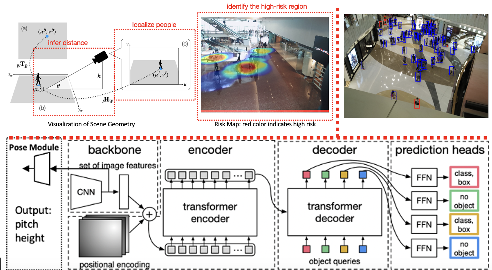

# XX-Net: Assessing Social Distancing Compliance

Social distance is an effective measure to prevent the spreading of infectious diseases. It has gained significant attention since the outbreak of the COVID-19 pandemic. The previous study has proved the possibility of inferring the real-world distance between people and identifying the high-risk region by surveillance camera parameters and images. However, those models still suffer from missing recognition of people in the occluded cases. XX-Net, modified from the existing detection-based method, is proposed for joint geometry reasoning and better identification of people instances in the bird-eye view. A novel and effective postprocess procedure is introduced for mitigating the missing recognition problem. It reaches state-of-the-art performance on all evaluation metrics. XX-Net represents **eXtends** from a detection-based method and **eXtracts** the missing boxes from the low-confidence predictions.

# Train
To avoid overfitting, only enable the pose module training in last 5 epoches after the detection training for 25 epoches.

##### 25 epochs

python main.py --output_dir logs/train1_demo -c configs/DINO/DINO_4scale_swin.py --coco_path ./ --pretrain_model_path ./checkpoints/checkpoint0029_4scale_swin.pth --options dn_scalar=100 embed_init_tgt=TRUE  dn_label_coef=1.0 dn_bbox_coef=1.0 use_ema=False  dn_box_noise_scale=1.0 backbone_dir=./checkpoints --use_dino_pertrained

#### 5 epochs

python main.py --output_dir logs/with_pose_demo -c configs/DINO/DINO_4scale_swin.py --coco_path ./ --pretrain_model_path logs/train1/checkpoint.pth --options dn_scalar=100 embed_init_tgt=TRUE  dn_label_coef=1.0 dn_bbox_coef=1.0 use_ema=False  dn_box_noise_scale=1.0 backbone_dir=./checkpoints

# Eval
This part calculate the mAP scores

python main.py   --output_dir logs/DINO/eval1 -c configs/DINO/DINO_4scale_swin.py --coco_path ./  --eval      --resume logs/train1/checkpoint.pth     --options dn_scalar=100 embed_init_tgt=TRUE     dn_label_coef=1.0 dn_bbox_coef=1.0 use_ema=False     dn_box_noise_scale=1.0 backbone_dir=./checkpoints/

# Post process

python create_data.py
python train_classifier.py
python verify.py

# Test
python test.py  --task-option-file configs/option.yaml --use-gpus 0

python run_metrics.py         --task-option-file configs/option.yaml         --model-output-file logs/test/DINO/Apr08_20-55-17/test/model-output.h5         --output-csv logs/test/DINO/Apr08_20-55-17/test/metric_result.csv         --use-gpu 0
